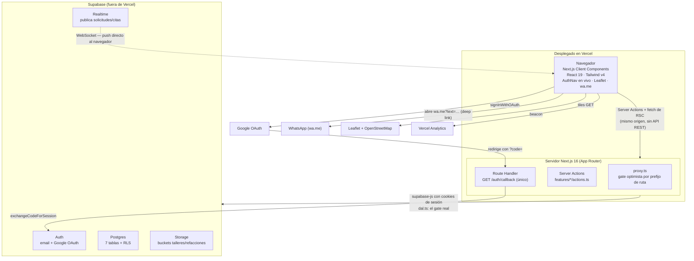
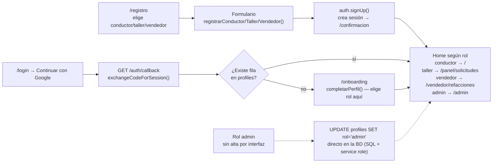
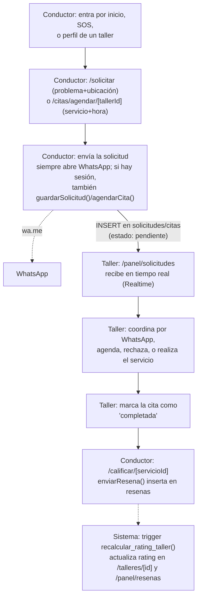

This is a [Next.js](https://nextjs.org) project bootstrapped with [`create-next-app`](https://nextjs.org/docs/app/api-reference/cli/create-next-app).

## Arquitectura y flujos de Motores en Marcha

> Generado a partir de una lectura del código y una recorrida real de la app en `localhost:3000` (18 de septiembre de 2026).

### Resumen del stack

- **Framework**: Next.js 16 (App Router), fork con `src/proxy.ts` en vez de `middleware.ts` — ver `AGENTS.md`.
- **UI**: React 19, Tailwind v4, `lucide-react`, Leaflet/OpenStreetMap para mapas.
- **Backend**: Supabase — Auth (email + Google OAuth), Postgres con Row Level Security, Storage, Realtime. Sin ORM.
- **Sin API REST propia**: toda la escritura pasa por Server Actions (`src/features/*/actions.ts`). El único Route Handler es `GET /auth/callback`.
- **Hosting**: Vercel (sin Docker/`vercel.json`), `@vercel/analytics`.
- **Tablas** (todas con RLS): `talleres`, `resenas`, `solicitudes`, `citas`, `profiles`, `vendedores`, `refacciones`.
- **Doble gate de autenticación**: `src/proxy.ts` (redirect optimista por prefijo de ruta) + `src/lib/auth/dal.ts` (`requireUser/requireAdmin/requireVendedor`, respaldado por RLS en la base de datos).

### Diagrama de arquitectura



No existe `src/app/api/`: cada mutación viaja como Server Action, y Postgres nunca confía en el gate de `proxy.ts` — cada tabla repite la regla por RLS.

### Flujo: alta de cuenta (y por qué admin es distinto)



El registro por email crea el perfil al instante; Google puede dejar a alguien "autenticado pero sin rol", por eso existe `/onboarding` como red de seguridad. El rol admin no tiene alta propia: se asigna directo en la base de datos.

### Flujo: pedir ayuda → agendar → calificar



La fila se escribe en la base de datos aunque el conductor sea un invitado sin sesión — solo cambia que, sin cuenta, no queda historial propio en "Mis solicitudes".

### Tabla de rutas

| Ruta | Qué es | Auth | Layout/sección |
|---|---|---|---|
| `/` | Home / buscador de problema | No | Pública |
| `/talleres`, `/talleres/[id]` | Listado y perfil de taller | No | Pública |
| `/refacciones`, `/refacciones/[id]` | Catálogo de autopartes | No | Pública |
| `/solicitar` | Formulario de ayuda / SOS | No | Pública |
| `/login`, `/registro`, `/registro/{conductor,taller,vendedor}` | Auth | Solo invitados | `(auth)` |
| `/confirmacion` | Pantalla post-alta | No | `(auth)` |
| `/onboarding` | Completar perfil (post Google) | Sí | — |
| `/auth/callback` | Route Handler OAuth | n/a | — |
| `/cuenta`, `/cuenta/vehiculo`, `/cuenta/solicitudes`, `/cuenta/notificaciones` | Dashboard conductor | Sí | `DashboardShell` |
| `/citas/agendar/[tallerId]`, `/citas/mis-citas` | Agendar / ver citas | Sí | `DashboardShell` |
| `/calificar/[servicioId]` | Calificar servicio | Sí | — |
| `/panel/solicitudes`, `/panel/cuenta`, `/panel/resenas`, `/panel/sucursales`, `/panel/notificaciones` | Dashboard taller | Sí | `DashboardShell` |
| `/vendedor/refacciones`, `/vendedor/cuenta` | Dashboard vendedor | Sí | `DashboardShell` |
| `/admin`, `/admin/cuenta` | Dashboard admin | Sí, rol admin | `DashboardShell` |
| `/terminos`, `/privacidad`, `/cookies` | Legales | No | `(legal)` |
| `/robots.txt`, `/sitemap.xml` | SEO generado | n/a | — |

### Verificación de rutas — 18 de septiembre de 2026

Se levantó `npm run dev` en `localhost:3000` y se navegó cada ruta con el navegador real, incluyendo alta de cuentas de prueba para conductor, taller y vendedor, y un ciclo completo de agendar cita.

**Resultado general**: todas las rutas públicas, de auth y protegidas (conductor/taller/vendedor) cargaron correctamente. Los guardas de `proxy.ts` redirigieron bien en ambos sentidos (`/login?next=…` para no autenticados en ruta protegida; `/` para autenticados en `/login` o `/registro`). `requireAdmin()` redirigió correctamente a un usuario no-admin. `/calificar/[id-inexistente]` devolvió un 404 limpio en vez de crashear. La consola del navegador y el log del servidor quedaron sin un solo error o warning durante toda la sesión.

**Hallazgos:**

- `/refacciones` muestra "0 refacciones encontradas": `supabase/seed.sql` solo carga talleres y reseñas de ejemplo, no vendedores ni refacciones.
- Se completó de punta a punta: agendar cita con "Taller El Rápido" → aparece en `/citas/mis-citas` del conductor de prueba.
- **No verificado en vivo**: `/admin` con una cuenta admin real, ni `/calificar` con una cita en estado "completada". No existe alta de admin por interfaz, y forzar esos estados requiere escribir directo en Supabase con la `service role key`; el clasificador de auto-mode bloqueó ese script y se decidió omitirlo en vez de forzarlo. Sí se confirmó el comportamiento de sus guardas.
- Cuentas de prueba creadas (quedan en el proyecto real de Supabase, contraseña `TestQA12345!` las tres — se pueden borrar cuando se quiera): `shugar.admin+qaconductor@shugar.mx`, `shugar.admin+qataller@shugar.mx`, `shugar.admin+qavendedor@shugar.mx`.

## Getting Started

First, run the development server:

```bash
npm run dev
# or
yarn dev
# or
pnpm dev
# or
bun dev
```

Open [http://localhost:3000](http://localhost:3000) with your browser to see the result.

You can start editing the page by modifying `app/page.tsx`. The page auto-updates as you edit the file.

This project uses [`next/font`](https://nextjs.org/docs/app/building-your-application/optimizing/fonts) to automatically optimize and load [Geist](https://vercel.com/font), a new font family for Vercel.

## Learn More

To learn more about Next.js, take a look at the following resources:

- [Next.js Documentation](https://nextjs.org/docs) - learn about Next.js features and API.
- [Learn Next.js](https://nextjs.org/learn) - an interactive Next.js tutorial.

You can check out [the Next.js GitHub repository](https://github.com/vercel/next.js) - your feedback and contributions are welcome!

## Deploy on Vercel

The easiest way to deploy your Next.js app is to use the [Vercel Platform](https://vercel.com/new?utm_medium=default-template&filter=next.js&utm_source=create-next-app&utm_campaign=create-next-app-readme) from the creators of Next.js.

Check out our [Next.js deployment documentation](https://nextjs.org/docs/app/building-your-application/deploying) for more details.
# motoresenmarchaWeb
# motoresenmarchaWeb
